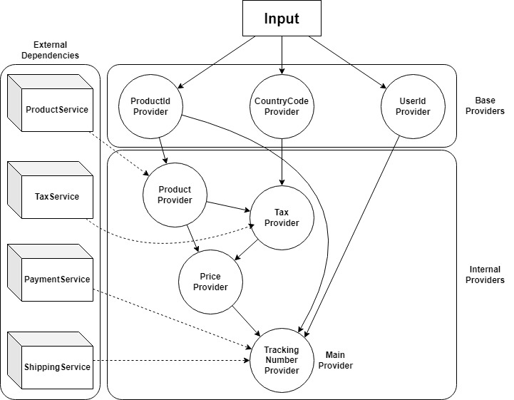

# Provider Component Library

The Provider Component Library (**PCL**) helps you structure
services by splitting them into logically independent components called providers,
that depend on one another. It is useful for services that have:
- lots of complicated business logic
- very light computation within the service (most of the latency comes
from waiting for dependencies to return)

## Framework
### Definitions
A provider is a Java class that produces an object of a certain type.
For example, a `PriceProvider` may be a `Double` provider, because it provides
a price that can be represented by a `Double`.

We define 3 different types of providers:
- **base** provider — depends only on the input and nothing else. 
Usually extracts a single attribute from the input to the service. ([example](src/test/java/com/pcl/simpleservice/providers/base/UserIdProvider.java))
- **internal** provider — depends on other providers and possibly
dependant services. ([example](src/test/java/com/pcl/simpleservice/providers/internal/PriceProvider.java))
- **main** provider — a designated internal provider that contains
the core logic of the service. It represents the key responsibility
of the service.

#### Dependencies
We define dependencies as providers needed in the execution of another provider.
For example, let provider A depend on providers D1, D2 and D3. This means
that throughout the flow of A, it may need the results of providers
D1, D2 and D3. Providers that are dependencies of a provider and are
always required in its flow are called *hard* dependencies. These dependencies 
should be marked with the [`@Hard`](src/main/java/com/pcl/annotation/Hard.java) annotation.

### Evaluation

During the evaluation of a request a provider may be needed as a 
dependency of several providers. If a provider is needed several times
during the flow of a request, it will be evaluated only once and will
return the same result (or throw the same exception) every time its result is needed. 

By default, results of hard dependencies of a provider will be prefetched in parallel
when evaluating the provider as they are sure to be needed
in the flow. Results of other (non-hard) providers will be evaluated on demand as they
may not be required in the flow.

### Advantages
There are several advantages of PCL to conventional methods of
structuring a service:
- strong componentization — there is a clear separation between
different providers. Changing the logic of a provider is limited to
this provider only. If new inputs are required to a provider they
need not be passed around several classes, but only added as dependencies
to the provider. Adding and removing dependencies are limited to the
provider only.
- data immutability — all components that depend on a certain provider
will receive the same object.
- intuitive code changes — define what you need and where you need it
- optimal parallelization — a lot of services don't contain heavy computation
and the majority of the request is waiting for dependencies. The more complex
a service becomes, the harder it gets to identify which parts can be
executed in parallel and the time it would take to refactor is often
not worth the advantages it brings. PCL is parallelizable by default
as all hard dependencies of all providers can be evaluated in parallel. 

## Example

### Simple service
Let's have a look at a simple example of a service that charges a customer for a
product and places an order, returning the tracking number of the shipping. Using PCL,
the data flow diagram may look something like this:

The first layer of providers are the base providers, and they are only
dependent on the input. The rest of the providers depend on other providers
and some of them on external services. The main logic of the
service is captured by the [TrackingNumberProvider](src/test/java/com/pcl/simpleservice/providers/internal/TrackingNumberProvider.java).
This will be the provider that will be run when the request starts executing.
It in turn will start running other providers to get the inputs they need and so on. 

The [source code](src/test/java/com/pcl/simpleservice) for this example can be found in the test package.

### Bigger example
In the previous small example we don't gain much advantage from the parallelization,
but in bigger services the advantages are apparent. The test package contains
another example with a service of 50 base and 200 internal providers. 
The internal providers have 3 sleep delays in random places within their flows, simulating network calls, ranging from 20-90ms.
The total sleep time is ≈32 seconds, but running the [BigServiceTest](src/test/java/com/pcl/bigservice/BigServiceTest.java)
executes in ≈9.8 seconds, achieving a 3x speedup. Identifying which tasks
are parallelizable in this service by hand is not feasible.

## FAQ
**Q: How small should a provider be?**

**A:** Ideally as small as possible. A good provider should be structured in 
such a way, that it is clear how it provides its object, without having
to navigate to other classes. 